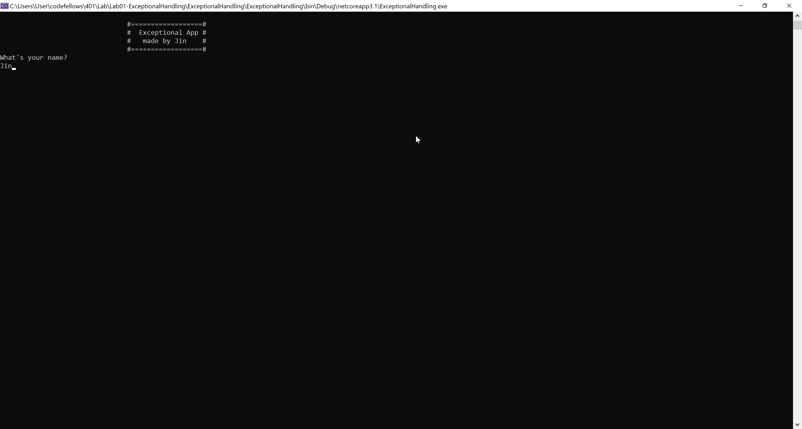
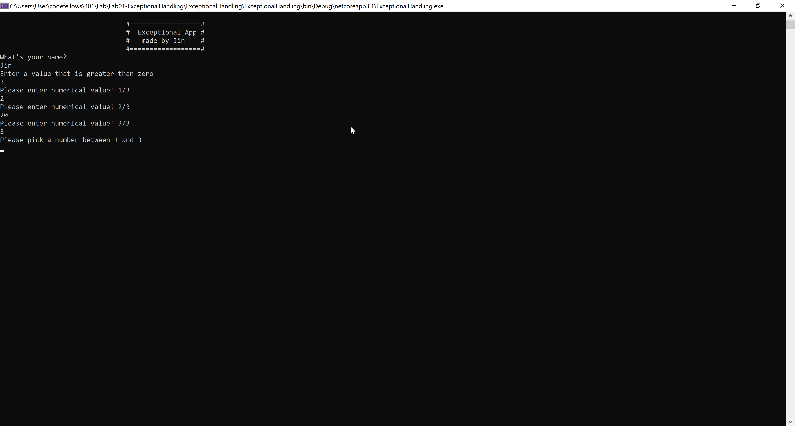
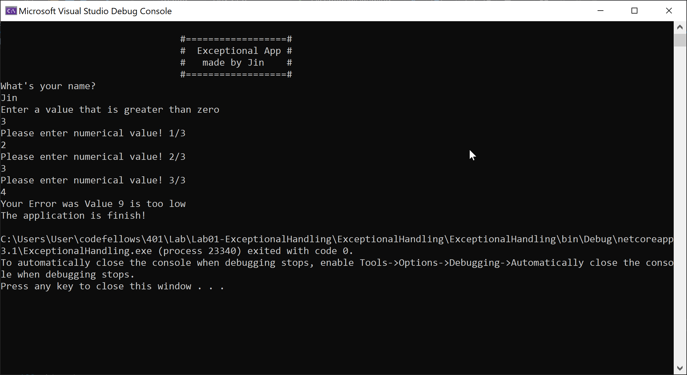

# Lab01-ExceptionalHandling
Console application that takes inputs from user and add, multiply and divide according to the input to output final quotient number.

**Author: Jin Kim**

## The purpose of this program
This application is a gaming console appliction that is run in commnad line/ terminal. User will enter in numerical values and in the end, choices will reflect on the outcome of total number.

## How to Run the Application
1. Clone this repo to your local machine and directory.
2. Enter into ExceptionalHandling/ExceptionalHandling folder
3. Then in the command line/terminal type in `dotnet run` which will start the application.
4. First type in your name into the console
5. Then it will ask for for numerical value that is higher than 0 and this will be "declared number".
6. Upon entering your input, it will then ask random numbers for amount of times that you previously declared  
	- Please enter higher number then 20, otherwise console will give you an error.
7. Console will sum up all of the chosen values.
8. Thereafter, console will ask you to pick a number between 1 to declared number.
9. Console then will use this number and multiply to the sum resulted value.
10. Then console will ask to choose number again that will be used to divide the total number so far.
11. Shortly after, console will compute all of your output and display on the screen.

## Screenshot

Index page

Correct inputs scren

Error message screen

Final message screen

